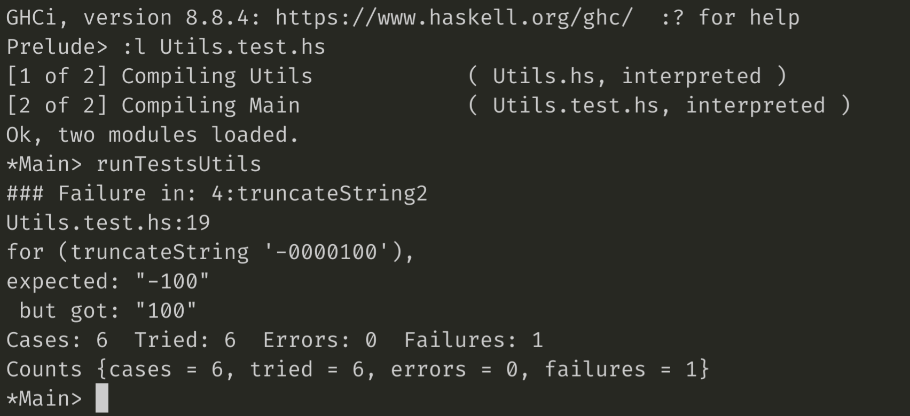
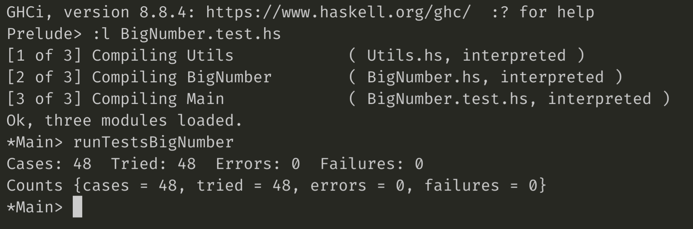
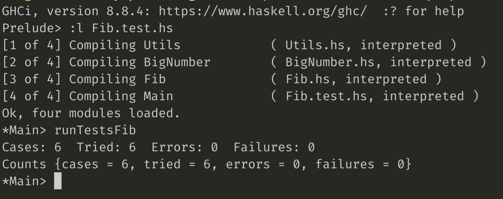

# Programação Funcional e Lógica


#### Contributors

**G6_07**

- [Deborah Lago](mailto:up201806102@up.pt) up201806102
- [José Macedo](mailto:up201705226@up.pt) up201705226
- [Tiago Lima Rocha](mailto:up201406679@up.pt) up201406679

## Table of Contents

- [Programação Funcional e Lógica](#programação-funcional-e-lógica)
      - [Contributors](#contributors)
  - [Table of Contents](#table-of-contents)
  - [Abstract](#abstract)
  - [Functions and Test Cases](#functions-and-test-cases)
    - [BigNumber Module](#bignumber-module)
      - [**scanner :: String -> BigNumber**](#scanner--string---bignumber)
      - [**output :: BigNumber -> String**](#output--bignumber---string)
      - [**somaBN :: BigNumber -> BigNumber -> BigNumber**](#somabn--bignumber---bignumber---bignumber)
      - [**subBN :: BigNumber -> BigNumber -> BigNumber**](#subbn--bignumber---bignumber---bignumber)
      - [**mulBN :: BigNumber -> BigNumber -> BigNumber**](#mulbn--bignumber---bignumber---bignumber)
      - [**divBN :: BigNumber -> BigNumber -> (BigNumber, BigNumber)**](#divbn--bignumber---bignumber---bignumber-bignumber)
      - [**safeDivBN :: BigNumber -> BigNumber -> (BigNumber, BigNumber)**](#safedivbn--bignumber---bignumber---bignumber-bignumber)
      - [**minBN :: BigNumber -> BigNumber -> BigNumber**](#minbn--bignumber---bignumber---bignumber)
      - [**maxBN :: BigNumber -> BigNumber -> BigNumber**](#maxbn--bignumber---bignumber---bignumber)
      - [**negBN :: BigNumber -> BigNumber**](#negbn--bignumber---bignumber)
      - [**isZeroBN :: BigNumber -> Bool**](#iszerobn--bignumber---bool)
      - [**isNegBN :: BigNumber -> Bool**](#isnegbn--bignumber---bool)
      - [**isPosBN :: BigNumber -> Bool**](#isposbn--bignumber---bool)
      - [**absBN :: BigNumber -> BigNumber**](#absbn--bignumber---bignumber)
      - [**gtBN :: BigNumber -> BigNumber -> Bool**](#gtbn--bignumber---bignumber---bool)
      - [**ltBN :: BigNumber -> BigNumber -> Bool**](#ltbn--bignumber---bignumber---bool)
      - [**ltEqualBN :: BigNumber -> BigNumber -> Bool**](#ltequalbn--bignumber---bignumber---bool)
      - [**gtEqualBN :: BigNumber -> BigNumber -> Bool**](#gtequalbn--bignumber---bignumber---bool)
      - [**equalsBN :: BigNumber -> BigNumber -> Bool**](#equalsbn--bignumber---bignumber---bool)
    - [Fib Module](#fib-module)
      - [**fibRec :: (Integral a) => a -> a**](#fibrec--integral-a--a---a)
      - [fibLista2 :: Num b => Int -> b](#fiblista2--num-b--int---b)
      - [fibLista :: Num a => Int -> a](#fiblista--num-a--int---a)
      - [fibListaInfinita :: Num a => Int -> a](#fiblistainfinita--num-a--int---a)
      - [fibRecBN :: String -> String](#fibrecbn--string---string)
      - [fibListaBN :: String -> String](#fiblistabn--string---string)
      - [fibListaInfinitaBN :: Int -> String](#fiblistainfinitabn--int---string)
    - [Utils Module](#utils-module)
      - [**truncateString :: String ->  String**](#truncatestring--string----string)
      - [**xor :: Bool -> Bool -> Bool**](#xor--bool---bool---bool)
  - [Unit Test Results](#unit-test-results)
  - [Conclusion *(Exercise 4)*](#conclusion-exercise-4)

## Abstract
  
## Functions and Test Cases

Our project structure is comprised of three modules:
  - **Utils** - contains utility helper methods 
  - **BigNumber** - contains the big number type definition as well as a full fledged arithmetic library for big number calculations
  - **Fib** - contains methods for resolving fibonnacci numbers for both *Int* and *BigNumber* types

### BigNumber Module

- [BigNumber Module](https://github.com/zemacedo99/FEUP-PFL/blob/main/app/Src/BigNumber.hs)
- [BigNumber Tests](https://github.com/zemacedo99/FEUP-PFL/blob/main/app/Src/BigNumber.test.hs)

***
#### **scanner :: String -> BigNumber**

**scanner**: converts String into BN. Uses recursion and higher order function **map** to apply **read** to every Char of the String, prooducing the BigNumber(BN).

```haskell
scanner :: String -> BigNumber
scanner str
  | isNegativeNumber = head bigNumber * (-1) : tail bigNumber
  | otherwise = bigNumber
  where
    truncatedStr = truncateString str
    isNegativeNumber = head str == '-'
    numberStr = if isNegativeNumber then tail truncatedStr else truncatedStr
    bigNumber = map (read . (: "")) numberStr :: BigNumber
```

**Tests:**

``` haskell
scanner1 = TestCase (assertEqual "for (scanner '123')," [1,2,3] (scanner "123"))
scanner2 = TestCase (assertEqual "for (scanner '-123')," [-1,2,3] (scanner "-123"))
scanner3 = TestCase (assertEqual "for (scanner '-000123')," [-1,2,3] (scanner "-000123"))
scanner4 = TestCase (assertEqual "for (scanner '000123')," [1,2,3] (scanner "000123"))
scanner5 = TestCase (assertEqual "for (scanner '0')," [0] (scanner "0"))
```

***

#### **output :: BigNumber -> String**

**output**: converts BN into String. Uses comprehension list to treat negative numbers and to process a BN.
  
```haskell
output bn
  | isNegBN bn = "-" ++ show (head bn * (-1)) ++ [head (show digit) | digit <- drop 1 bn]
  | otherwise = [head (show digit) | digit <- bn]
```

**Tests:**

``` haskell
output1 = TestCase (assertEqual "for (output [1,2,3])," "123" (output [1,2,3]))
output2 = TestCase (assertEqual "for (output [-1,2,3])," "-123" (output [-1,2,3]))
output3 = TestCase (assertEqual "for (output [0])," "0" (output [0]))
```

***

#### **somaBN :: BigNumber -> BigNumber -> BigNumber**

**somaBN'**: sums 2 BNs recursively using carry.

**somaBN**: checks base cases for sum operation and calls the appropriate functions to execute the operation (either somaBN' or subBN)

```haskell
somaBN' :: Integral t => [t] -> [t] -> t -> [t]
somaBN' [] x carry
  | carry == 0 = x
  | otherwise = somaBN' [carry] x 0
somaBN' x [] carry
  | carry == 0 = x
  | otherwise = somaBN' [carry] x 0
somaBN' (x : xs) (y : ys) carry = val : somaBN' xs ys res
  where
    val = (x + y + carry) `rem` 10
    res = (x + y + carry) `quot` 10

somaBN :: BigNumber -> BigNumber -> BigNumber
somaBN bn1 bn2
  | isNegBn1 && isNegBn2 = negBN (absBn1 `somaBN` absBn2)
  | isNegBn1 && (absBn1 `gtBN` absBn2) = negBN (absBn1 `subBN` absBn2)
  | isNegBn1 && (absBn1 `ltBN` absBn2) = bn2 `subBN` absBn1
  | isNegBn2 && not (absBn1 `equalsBN` absBn2) = bn1 `subBN` absBn2
  | otherwise = reverse (somaBN' (reverse bn1) (reverse bn2) 0)
  where
    absBn2 = absBN bn2
    absBn1 = absBN bn1
    isNegBn1 = isNegBN bn1
    isNegBn2 = isNegBN bn2
```

**Tests:**

```haskell
somaBN1 = TestCase (assertEqual "for ([2] `somaBN` [-2,2])," [-2,0] ([2] `somaBN` [-2,2]))
somaBN2 = TestCase (assertEqual "for ([-2] `somaBN` [2,2])," [2,0] ([-2] `somaBN` [2,2]))
somaBN3 = TestCase (assertEqual "for ([-2] `somaBN` [-2,2])," [-2,4] ([-2] `somaBN` [-2,2]))
somaBN4 = TestCase (assertEqual "for ([2] `somaBN` [2,2])," [2,4] ([2] `somaBN` [2,2]))
somaBN5 = TestCase (assertEqual "for ([2,2] `somaBN` [-2])," [2,0] ([2,2] `somaBN` [-2]))
somaBN6 = TestCase (assertEqual "for ([-2,2] `somaBN` [2])," [-2,0] ([-2,2] `somaBN` [2]))
somaBN7 = TestCase (assertEqual "for ([-2,2] `somaBN` [-2])," [-2,4] ([-2,2] `somaBN` [-2]))
somaBN8 = TestCase (assertEqual "for ([2,2] `somaBN` [2])," [2,4] ([2,2] `somaBN` [2]))
```

***

#### **subBN :: BigNumber -> BigNumber -> BigNumber**

**subBN'**: subtracts 2 BNs recursively using carry

**subBN**: checks base cases for subtraction operation and calls the appropriate functions to execute the operation (either somaBN or subBN')

```haskell
subBN' :: [Int] -> [Int] -> Int -> [Int]
subBN' [] x carry
  | carry == 0 = x
  | otherwise = subBN' x [carry] 0

subBN' x [] carry
  | carry == 0 = x
  | otherwise = subBN' x [carry] 0

subBN' (x : xs) (y : ys) carry =  val : subBN' xs ys res
  where
    ny
      | y + carry >= 10 = 0
      | otherwise = y + carry
    nc
      | y + carry >= 10 = 1
      | otherwise = 0
    val
      | x >= ny =  x - ny
      | otherwise = x + 10 - ny
    res = if x >= ny then nc else 1 + nc

subBN :: BigNumber -> BigNumber -> BigNumber
subBN bn1 bn2
  | isNegBn1 && isNegBn2 = bn1 `somaBN` absBn2
  | isNegBn1 && ((absBn1 `gtBN` absBn2) || (absBn1 `ltBN` absBn2)) = negBN (absBn1 `somaBN` absBn2)
  | isNegBn2 && absBn2 `gtBN` absBn1 = absBn1 `somaBN` absBn2
  | isNegBn2 && absBn2 `ltBN` absBn1 = bn1 `somaBN` absBn2
  | absBn1 `equalsBN` absBn2 = [0]
  | bn1 `gtBN` bn2 = scanner(output(reverse (subBN' revBn1 revBn2 0)))
  | otherwise = negBN (scanner(output(reverse (subBN' revBn2 revBn1 0))))
  where
    revBn1 = reverse bn1
    revBn2 = reverse bn2
    absBn1 = absBN bn1
    absBn2 = absBN bn2
    isNegBn1 = isNegBN bn1
    isNegBn2 = isNegBN bn2
```

**Tests:**

```haskell
subBN1 = TestCase (assertEqual "for ([2] `subBN` [-2,2])," [2,4] ([2] `subBN` [-2,2]))
subBN2 = TestCase (assertEqual "for ([-2] `subBN` [2,2])," [-2,4] ([-2] `subBN` [2,2]))
subBN3 = TestCase (assertEqual "for ([-2] `subBN` [-2,2])," [2,0] ([-2] `subBN` [-2,2]))
subBN4 = TestCase (assertEqual "for ([2] `subBN` [2,2])," [-2,0] ([2] `subBN` [2,2]))
subBN5 = TestCase (assertEqual "for ([2,2] `subBN` [-2])," [2,4] ([2,2] `subBN` [-2]))
subBN6 = TestCase (assertEqual "for ([-2,2] `subBN` [2])," [-2,4] ([-2,2] `subBN` [2]))
subBN7 = TestCase (assertEqual "for ([-2,2] `subBN` [-2])," [-2,0] ([-2,2] `subBN` [-2]))
subBN8 = TestCase (assertEqual "for ([2,2] `subBN` [2])," [2,0] ([2,2] `subBN` [2]))
subBN9 = TestCase (assertEqual "for ([1] `subBN` [2])," [-1] ([1] `subBN` [2]))
subBN10 = TestCase (assertEqual "for ([3,0] `subBN` [1])," [2,9] ([3,0] `subBN` [1]))
subBN11 = TestCase (assertEqual "for ([1] `subBN` [3,0])," [-2,9] ([1] `subBN` [3,0]))
subBN12 = TestCase (assertEqual "for ([2,2] `subBN` [1,0,0])," [-7,8] ([2,2] `subBN` [1,0,0]))
subBN13 = TestCase (assertEqual "for ([2,6,2] `subBN` [1,5,8])," [1,0,4] ([2,6,2] `subBN` [1,5,8]))
```

***


#### **mulBN :: BigNumber -> BigNumber -> BigNumber**

**mulBN''**: multiplies 2 BNs recursively using carry

**mulBN'**: multiplies 2 BNs using comprehension lists

**mulBN**: checks base cases for multiplication operation and calls then calls mulBN'

```haskell
mulBN'' :: Int -> Int -> BigNumber -> BigNumber
mulBN'' a carry bn
  | null bn && carry == 0 = bn
  | null bn = [carry]
  | a == 0 = [0 | i <- bn]
  | a == 1 = bn
  | otherwise = res : mulBN'' a nextCarry (drop 1 bn)
  where
    res = if op >= 10 then op `rem` 10 else op
    nextCarry = if op >= 10 then op `div` 10 else 0
    op = a * head bn + carry

mulBN' :: BigNumber -> BigNumber -> BigNumber
mulBN' bn1 bn2 = foldl somaBN [0] resMulZeros
  where
    rbn1 = reverse bn1
    rbn2 = reverse bn2
    resMulZeros = head resMul : [resMul !! i ++ replicate i 0 | i <- [0..length resMul - 1], i > 0]
    resMul = [reverse (mulBN'' a 0 rbn1) | a <- rbn2]

mulBN :: BigNumber -> BigNumber -> BigNumber
mulBN bn1 bn2
  | output bn1 == "-1" = negBN bn2
  | output bn2 == "-1" = negBN bn1
  | isZeroBN bn1 || isZeroBN bn2 = [0]
  | isNegBN bn1 `xor` isNegBN bn2 = negBN (mulBN' (negBN negative) positive)
  | isNegBN bn1 && isNegBN bn2 =  mulBN' (negBN bn1)  (negBN bn2)
  | otherwise = mulBN' bn1 bn2
  where
    negative = if isNegBN bn1 then bn1 else bn2
    positive = if isNegBN bn1 then bn2 else bn1    
```

**Tests:**

```haskell
mulBN1 = TestCase (assertEqual "([0] `mulBN` [1,2,3])," [0] ([0] `mulBN` [1,2,3]))
mulBN2 = TestCase (assertEqual "([1,2,3] `mulBN` [0])," [0] ([1,2,3] `mulBN` [0]))
mulBN3 = TestCase (assertEqual "([1] `mulBN` [1,2,3])," [1,2,3] ([1] `mulBN` [1,2,3]))
mulBN4 = TestCase (assertEqual "([1,2,3] `mulBN` [1])," [1,2,3] ([1,2,3] `mulBN` [1]))
mulBN5 = TestCase (assertEqual "([-1] `mulBN` [1,2,3])," [-1,2,3] ([-1] `mulBN` [1,2,3]))
mulBN6 = TestCase (assertEqual "([1,2,3] `mulBN` [-1])," [-1,2,3] ([1,2,3] `mulBN` [-1]))
mulBN7 = TestCase (assertEqual "([1,2,3] `mulBN` [1,0])," [1,2,3,0] ([1,2,3] `mulBN` [1,0]))
mulBN8 = TestCase (assertEqual "([1,2,3] `mulBN` [-1,0])," [-1,2,3,0] ([1,2,3] `mulBN` [-1,0]))
mulBN9 = TestCase (assertEqual "([2] `mulBN` [5])," [1,0] ([2] `mulBN` [5]))
mulBN10 = TestCase (assertEqual "([-2] `mulBN` [5])," [-1,0] ([-2] `mulBN` [5]))
mulBN11 = TestCase (assertEqual "([-9,9,9,9,9,9,9] `mulBN` [-9,9,9,9,9,9,9])," [9,9,9,9,9,9,8,0,0,0,0,0,0,1] ([-9,9,9,9,9,9,9] `mulBN` [-9,9,9,9,9,9,9]))
```

***


#### **divBN :: BigNumber -> BigNumber -> (BigNumber, BigNumber)**

**divBN**: divides 2 BNs using comprehension list that generates all multiples of the divisor. Uses the function **takeWhile** and **ltEqualBN** to stop the list generation.

```haskell
divBN :: BigNumber -> BigNumber -> (BigNumber, BigNumber)
divBN bn1 bn2 
  | bn1 `gtEqualBN` bn2 = (quociente,resto)
  | bn1 `ltBN` bn2 = ([0], bn1)
  | otherwise = ([0],[0])
  where
    multiplesListInf = [mulBN bn x | bn <- repeat bn2, x <- listaInfBN [1]]
    multiplesList = takeWhile (`ltEqualBN` bn1 ) multiplesListInf
    lastMultiple = last multiplesList
    quociente = scanner (show (length multiplesList))
    resto     = scanner (output (bn1 `subBN` lastMultiple))
```

**Tests:**
```haskell
divBN1 = TestCase (assertEqual "for ([1,0] `divBN` [2])," ([5],[0]) ([1,0] `divBN` [2]))
divBN2 = TestCase (assertEqual "for ([0] `divBN` [1])," ([0],[0]) ([0] `divBN` [1]))
divBN3 = TestCase (assertEqual "for ([2] `divBN` [1,0])," ([0],[2]) ([2] `divBN` [1,0]))
divBN4 = TestCase (assertEqual "for ([1] `divBN` [2])," ([0],[1]) ([1] `divBN` [2]))
divBN5 = TestCase (assertEqual "for ([1,2,3,4] `divBN` [5])," ([2,4,6],[4]) ([1,2,3,4] `divBN` [5]))
divBN6 = TestCase (assertEqual "for ([1,2,3,4] `divBN` [4,3,2])," ([2],[3,7,0]) ([1,2,3,4] `divBN` [4,3,2]))
divBN7 = TestCase (assertEqual "for ([1,2,3,4] `divBN` [1,2,3,4])," ([1],[0]) ([1,2,3,4] `divBN` [1,2,3,4]))
```

***


#### **safeDivBN :: BigNumber -> BigNumber -> (BigNumber, BigNumber)**

**safeDivBN**: ensures that divBN can divide a BN with zero, returning a Monad of type Maybe. When bn2 is zero, it returns Nothing. Otherwise, it calls divBN to execute the division.

```haskell
safeDivBN :: BigNumber -> BigNumber -> Maybe (BigNumber, BigNumber)
safeDivBN bn1 bn2
  | isZeroBN bn2 = Nothing 
  | otherwise = Just(divBN bn1 bn2)
```

**Tests:**
```haskell
safeDivBN1 = TestCase (assertEqual "for ([2] `divBN` [0])," Nothing ([2] `safeDivBN` [0]))
```

***

#### **minBN :: BigNumber -> BigNumber -> BigNumber**

**minBN**: returns the smaller BN between two

```haskell
minBN :: BigNumber -> BigNumber -> BigNumber
minBN bn1 bn2 = min
  where
    min
      | isNegBN bn1 && isNegBN bn2  =  minNeg
      | isNegBN bn1  =  bn1
      | isNegBN bn2  =  bn2
      | otherwise = minPos
    minNeg
      | output bn1 == output bn2 = bn1
      | length bn1 > length bn2 = bn1
      | length bn2 > length bn1 = bn2
      | head bn1 > head bn2 = bn1
      | head bn2 > head bn1 = bn2
      | otherwise = head bn1 : maxBN (drop 1 bn1) (drop 1 bn2)
    minPos
      | output bn1 == output bn2 = bn1
      | length bn1 < length bn2 = bn1
      | length bn2 < length bn1 = bn2
      | head bn1 < head bn2 = bn1
      | head bn2 < head bn1 = bn2
      | otherwise = head bn1 : minBN (drop 1 bn1) (drop 1 bn2)
```

***


#### **maxBN :: BigNumber -> BigNumber -> BigNumber**

**maxBN**: returns the bigger BN between two.

```haskell
maxBN :: BigNumber -> BigNumber -> BigNumber
maxBN bn1 bn2 = max
  where
    max
      | isNegBN bn1 && isNegBN bn2  =  maxNeg
      | isNegBN bn1  =  bn2
      | isNegBN bn2  =  bn1
      | otherwise = maxPos
    maxNeg
      | output bn1 == output bn2 = bn1
      | length bn1 > length bn2 = bn2
      | length bn2 > length bn1 = bn1
      | head bn1 > head bn2 = bn2
      | head bn2 > head bn1 = bn1
      | otherwise = head bn1 : minBN (drop 1 bn1) (drop 1 bn2)
    maxPos
      | output bn1 == output bn2 = bn1
      | length bn1 > length bn2 = bn1
      | length bn2 > length bn1 = bn2
      | head bn1 > head bn2 = bn1
      | head bn2 > head bn1 = bn2
      | otherwise = head bn1 : maxBN (drop 1 bn1) (drop 1 bn2)
```

***

#### **negBN :: BigNumber -> BigNumber**

**negBN**: returns the BN with opposite parity.

```haskell
negBN :: BigNumber -> BigNumber
negBN bn = (head bn * (-1)) : tail bn
```

***

#### **isZeroBN :: BigNumber -> Bool**

**isZeroBN**: checks if a BN is zero. If it is, returns True.

```haskell
isZeroBN :: BigNumber -> Bool
isZeroBN bn = sum bn == 0
```

***

#### **isNegBN :: BigNumber -> Bool**

**isNegBN**: checks if a BN is negative. If it is, returns True.

```haskell
isNegBN :: BigNumber -> Bool
isNegBN bn = head bn < 0
```

***

#### **isPosBN :: BigNumber -> Bool**

**isPosBN**: checks if a BN is positive. If it is, returns True.

```haskell
isPosBN :: BigNumber -> Bool
isPosBN bn = head bn > 0
```

***

#### **absBN :: BigNumber -> BigNumber**

**absBN**: returns the absolute value of the BN.

```haskell
absBN :: BigNumber -> BigNumber
absBN bn
 | isNegBN bn = (head bn * (-1)) : drop 1 bn
 | otherwise = bn
```

***

#### **gtBN :: BigNumber -> BigNumber -> Bool**

**gtBN**: compares if one big number is greater than the other

```haskell
gtBN :: BigNumber -> BigNumber -> Bool
gtBN bn1 bn2
  | bn1 `equalsBN` bn2 = False
  | otherwise = maxBN bn1 bn2 == bn1
```

***

#### **ltBN :: BigNumber -> BigNumber -> Bool**

**ltBN**: compares if one big number is lesser than the other

```haskell
ltBN :: BigNumber -> BigNumber -> Bool
ltBN bn1 bn2
  | bn1 `equalsBN` bn2 = False
  | otherwise = maxBN bn1 bn2 == bn2
```

***

#### **ltEqualBN :: BigNumber -> BigNumber -> Bool**

**ltEqualBN**: compares if one big number is lesser than or equal to the other

```haskell
ltEqualBN :: BigNumber -> BigNumber -> Bool
ltEqualBN bn1 bn2
  | bn1 `equalsBN` bn2 = True
  | otherwise = maxBN bn1 bn2 == bn2
```

***

#### **gtEqualBN :: BigNumber -> BigNumber -> Bool**

**gtEqualBN**: compares if one big number is greater than or equal to the other

```haskell
gtEqualBN :: BigNumber -> BigNumber -> Bool
gtEqualBN bn1 bn2
  | bn1 `equalsBN` bn2 = True
  | otherwise = maxBN bn1 bn2 == bn1
```

***

#### **equalsBN :: BigNumber -> BigNumber -> Bool**

**equalsBN**: checks if two big numbers are equal

```haskell
equalsBN :: BigNumber -> BigNumber -> Bool
equalsBN bn1 bn2 = bn1 == bn2
```

***

### Fib Module

- [Fib Module](https://github.com/zemacedo99/FEUP-PFL/blob/main/app/Src/Fib.hs)
- [Fib Tests](https://github.com/zemacedo99/FEUP-PFL/blob/main/app/Src/Fib.test.hs)

***

#### **fibRec :: (Integral a) => a -> a**

**fibRec**: Normal recursion algorythm for Fibonacci. Two base cases and two recursion calls.

```haskell
fibRec n
  | n == 0 = 1
  | n == 1 = 1
  | otherwise = fibRec (n - 1) + fibRec (n - 2)
```

**Tests:**
```haskell
fibRec1 = TestCase (assertEqual "Should give the first 30 fibonnacci numbers" resInt ([fibRec n | n <- [0..30]]))
```

***

#### fibLista2 :: Num b => Int -> b

**fibLista2**: in this version of FibLista, we use the function **foldl** so we can access the partial results of the list without needing to wait for the whole processing. It also ensures compiler optimization without bursting the stack. At the same time, the fold process reflects the change of state. The initial state is calculated step by step to get the final state, which is in line with the idea of ​​dynamic programming, so I think this is a recursive form of dynamic programming in functional programming.

```haskell
fibLista2' :: Num b => (b, b) -> p -> (b, b)
fibLista2' (a, b) _ = (b, a + b)

fibLista2 :: Num b => Int -> b
fibLista2 n = snd (foldl fibLista2' (1, 1) (replicate (n - 1) 0))
```

**Tests:**
```haskell
fibLista21 = TestCase (assertEqual "Should give the first 30 fibonnacci numbers" resInt ([fibLista2 n | n <- [0..30]]))
```

***

#### fibLista :: Num a => Int -> a

**fibLista**: Calculates the nth Fibonacci number using the higher order function **map** to create the Fibonacci list with the sum of recursive call of the last two numbers on the list.The index operator **!!** is used to access the partial result, which is the nth number.

```haskell
fibLista :: Num a => Int -> a
fibLista n = fibLista !! n
  where
    fibLista = 1 : 1 : map f [2 ..]
    f n = fibLista !! (n - 1) + fibLista !! (n - 2) 
```

**Tests:**
```haskell
fibLista1 = TestCase (assertEqual "Should give the first 30 fibonnacci numbers" resInt ([fibLista n | n <- [0..30]]))
```

***

#### fibListaInfinita :: Num a => Int -> a

**fibListaInfinita**: Calculates an infinite list of Fibonnacci numbers by producing the list of corresponding sums of the ever growing Fibonnacci list with its tail. Uses the function **zipWith** to do that.

```haskell
fibListaInfinita :: Num a => Int -> a
fibListaInfinita n =
  let fib = 0 : 1 : zipWith (+) fib (tail fib)
   in fib !! n
```

**Tests:**
```haskell
fibListaInfinita1 = TestCase (assertEqual "Should give the first 30 fibonnacci numbers" resInt ([fibListaInfinita n | n <- [0..30]]))
```

***

#### fibRecBN :: String -> String

**fibRecBN**: normal fibonnacci recursion using BigNumber type

```haskell
fibRecBN' :: BigNumber -> BigNumber
fibRecBN' bn
  | bn `equalsBN` [0] = [1]
  | bn `equalsBN` [1] = [1]
  | otherwise = fibRecBN' (bn `subBN` [1]) `somaBN` fibRecBN' (bn `subBN` [2])

fibRecBN :: String -> String
fibRecBN n = output (fibRecBN' (scanner n))
```

**Tests:**
```haskell
fibRecBN1 = TestCase (assertEqual "Should give the first 15 fibonnacci numbers" resString15 ([fibRecBN (show n) | n <- [0..15]]))
fibRecBN2 = TestCase (assertEqual "Should give the first 30 fibonnacci numbers" resString ([fibRecBN (show n) | n <- [0..30]]))
```

***

#### fibListaBN :: String -> String

**fibListaBN**: Optimized version of the recussive fibonnaci using a memoized list of results and lazy evaluation

```haskell
fibListaBN n = lista !! n
  where
    lista = [1] : [1] : map fib (listaInfBN [2])
    fib n = (lista !! read (output (n `subBN` [2])))`somaBN` (lista !! read (output (n `subBN` [1])))
```

**Tests:**
```haskell
fibListaBN1 = TestCase (assertEqual "Should give the first 30 fibonnacci numbers" resString ([fibListaBN n | n <- [0..30]]))
```

***

#### fibListaInfinitaBN :: Int -> String

**fibListaInfinitaBN**: generalises zip by zipping with the function given as the first argument, instead of a tupling function to create an infinite list of BigNumber fibonnacci sequence

```haskell
fibListaInfinitaBN' n =
  let fib = [0] : [1] : zipWith somaBN fib (tail fib)
   in fib !! n
```

**Tests:**
```haskell
fibListaInfinitaBN1 = TestCase (assertEqual "Should give the first 30 fibonnacci numbers" resString ([fibListaInfinitaBN n | n <- [0..30]]))
```

***

### Utils Module

- [Utils Module](https://github.com/zemacedo99/FEUP-PFL/blob/main/app/Src/Utils.hs)
- [Utils Tests](https://github.com/zemacedo99/FEUP-PFL/blob/main/app/Src/Utils.test.hs)

***

#### **truncateString :: String ->  String**

**truncateString**: truncates a string to the left such that if it contains zeros it removes them and if it has a
minus sign it keeps it.

```haskell
truncateString str 
  | str == "0" = "0"
  | otherwise = if isNegativeNumber then '-' : truncated else truncated
  where
    isNegativeNumber = head str == '-'
    truncated = dropWhile (== '0') (if isNegativeNumber then tail str else str)
```

**Tests:**
```haskell
truncateString1 = TestCase (assertEqual "for (truncateString '0000100')," "100" (truncateString "0000100"))
truncateString2 = TestCase (assertEqual "for (truncateString '-0000100')," "-100" (truncateString "0000100"))
truncateString3 = TestCase (assertEqual "for (truncateString '0')," "0" (truncateString "0"))
```

***

#### **xor :: Bool -> Bool -> Bool**

**xor**: resovles the *xor* bitwise operation between two conditions

```haskell
xor x y | x && not y = True
        | not x && y = True
        | otherwise = False
```

**Tests:**
```haskell
xor1 = TestCase (assertEqual "for (True xor True)," False (True `xor` True))
xor2 = TestCase (assertEqual "for (True xor True)," True (False `xor` True))
xor3 = TestCase (assertEqual "for (True xor True)," False (False `xor` False))
```

***

## Unit Test Results

| Utils.test.hs | BigNumber.test.hs | Fib.test.hs |
|---------------|-------------------|-------------|
|  |  |  |

## Conclusion *(Exercise 4)*  

In exercice 1 we implemented three methods for calculating the nth Fibonacci number. A recursive version *(1.1)*, an optimized version *(1.2)* of the previous function using a list of partial results *(dynamic programming)*, and a version *(1.3)* that generates an infinite list with all Fibonacci numbers and returns the element of order n.

In these variations of exercise 1, the calculations of the algorithms were applied with the type Int that have values within the range of -2147483647 to 2147483647. So the biggest value that our functions can take is 46, because the 47th fibonacci number is 2971215073 (which is greater than the maximum number an *Int* can represent).

Integer can be considered as a superset of Int. This value is not bounded by any number, hence an Integer can be of any length without any limitation.

In exercise 3, we implemented the same versions of the first exercise, but the calcutions of the algorithms were applied with the type *BigNumber*, which is represented by a list of *Ints*, so each of its digit is, in fact, an *Int*. For this purpose we created an entire arithmetic module for this new type with all the arithmetic operations as well as many other auxiliary functions. In haskell we can have infinite lists, so the biggest value that our new functions can take is also infinite.
